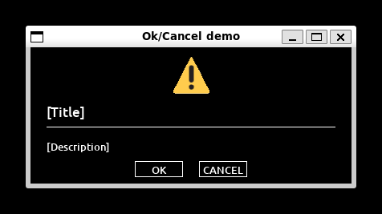
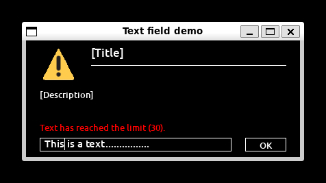
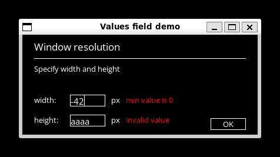

# sdl-cpp
## « A world of widgets »

### Overview

This is a `C++` library that encapsulates the `SDL2` software library and offers various widgets, tools and utility classes to develop complex `UI` environments.  
It was initially designed to simplify the development of my future graphics projects (see `github.com/pcapurro/paint-software`).  

The library is built around `4` levels of abstraction:  
1. A **primitive type**: encapsulates an `SDL` ressource (`SDL_Cursor*`, `TTF_Font*`, `SDL_Texture*`, etc) or simple properties (2D position, 2D dimensions, etc),  
\> Ex: `Cursor`, `TextTexture`, `ImageTexture`, `Properties` or `Point` classes.  

2. A **basic type**: encapsulates one or multiple **primitive types** along with properties,  
\> Ex: `Image`, `Shape` or `Text` classes.  

3. A **widget**: encapsulates one or multiple **basic types**,  
\> Ex: `TextButton` and `TextField` classes.  

4. A **window**: encapsulates one or multiple **widgets** and **basic types** and defines a **general behavior** (routine, events, inputs, etc).  
\> Ex: `DialogBox` and `DialogTextBox` classes.  

Note: **Widgets** and **basic types** inheriting from `Element` class support optional state propagation, implemented through protected virtual methods defined in `Element` class.  

The following three sections are dedicated to the presentation of `Engine` class and two windows made from the described levels.  

### Engine

The `Engine` class provides a flexible initialization of `SDL` subsystems, allowing optional activation of many parameters, such as video, antialisaing or audio.  

It will throw exceptions on initialization failure and ensure proper cleanup of `SDL` upon destruction.  

```
Engine  engine(
    true,           // video
    true,           // antialisaing
    true,           // TTF (fonts)
    true,           // events
    true,           // text input
    false           // audio
);
```

### DialogBox (TextButton)

The `DialogBox` class is a simple dialog window with a title, description, optional logo and multiple buttons representing predefined answers.  

The `routine()` method displays the window, manages user interaction and returns the index of the chosen button, or `END` if the window was closed.  

```
vector<string>      answers = {"OK", "CANCEL"};

DialogBox           window1(
    "Ok/Cancel demo",           // window title
    "OpenSans.ttf",             // font
    400, 170,                   // window dimensions
    DARK_MODE,                  // global color theme
    "[Title]",                  // title text
    true,                       // line limit between the title/logo and the description
    "[Description]",            // description text
    answers                     // possible answers (buttons)
    "logo.bmp", 55, 55, true    // logo path, dimensions and centering
);

int value = window1.routine();

if (value == END)
    cout << "User closed the window." << endl;

for (size_t i = 0; i < answers.size(); i++)
{
    if (i == (size_t) value - 1)
        cout << "User chose " << GREEN_TXT << answers[i] << END_COLOR "." << endl;
}
```



### DialogTextBox (TextField + TextButton)

The `DialogTextBox` class is similar to `DialogBox` class, but includes an interactive text field.  
It also features a dynamic text cursor that can be moved and used to edit text via arrow keys or the mouse.  

The `routine()` method also manages display and interaction, and `getFinalAnswer()` returns the string typed by the user if the window was not closed.  

```
DialogTextBox      window(
    "Text field demo",          // window title
    "OpenSans.ttf",             // main font
    400, 170,                   // window dimensions
    DARK_MODE,                  // global color theme
    "[Title]",                  // title text
    true,                       // line limit between the title/logo and the description
    "[Description]",            // description text       
    30                          // maximum characters
    "logo.bmp", 55, 55, true    // logo path, dimensions and centering
);

int value = window.routine();

if (value == END)
    cout << "User closed the window." << endl;
else
    cout << "User answered: '" << window.getFinalAnswer() << "'" << endl;
```



### DialogValuesBox (ValuesField + TextButton)

The `DialogValuesBox` class extends the behavior of `DialogTextBox` by adding interactive numeric input fields for integer values.  
The window can contain one or two fields, each customizable with a title, a unit label and a minimum/maximum value.  

The `routine()` method also manages display and interaction, and `getFinalValues()` returns the values entered by the user as a `vector<int>` if the window was not closed.  

```
DialogValuesBox     window(
    "Values field demo",        // window title
    "OpenSans.ttf",             // main font
    400, 170,                   // window dimensions
    DARK_MODE,                  // global color theme
    "Window resolution",        // title text
    true,                       // line limit between the title/logo and the description
    "Specify width and height", // description text       
    4,                          // maximum characters
    {"width:", "height:"},      // fields titles
    {"px", "px"},               // fields units
    {0, 0},                     // fields minimum values
    {1920, 1080}                // fields maximum values
);

int value = window.routine();

if (value == END)
    std::cout << "User closed the window." << std::endl;
else
{   
    vector<int> values = window.getFinalValues();

    std::cout << "User answered:" << std::endl;

    for (const auto& value: values)
        std::cout << value << " ; ";

    std::cout << std::endl;
}
```


